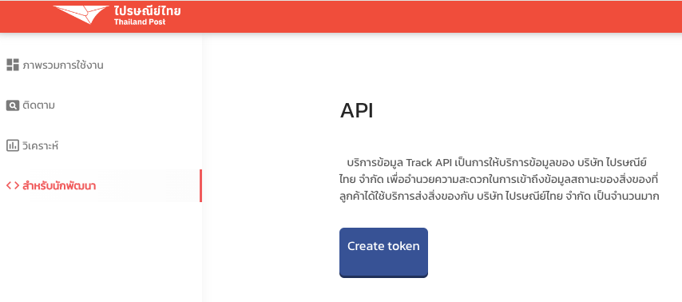

## Thailand Post Tracking

PHP Library สำหรับ tracking พัสดุของไปรษณีย์ไทย

อ้างอิงจากเว็บ APIs ของไปรษณีย์ไทย https://track.thailandpost.co.th/developerGuide

ซึ่ง Library ตัวนี้ทำหน้าที่ครอบ REST APIs ของทางไปรษณีย์ไทยอีกทีนึงเพื่อสะดวกในการใช้งาน

### สิ่งที่ต้องการ

- PHP 8.2 ขึ้นไป
- API Key จากไปรษณีย์ไทย (สามารถสร้างได้ที่ https://track.thailandpost.co.th/dashboard)


## การติดตั้ง
### ติดตั้งผ่าน Composer
การติดตั้งผ่าน Composer โดยใช้คำสั่งด้านล่าง
```
composer require farzai/thailand-post
```

## เริ่มต้นใช้งาน
ในการเริ่มต้นใช้งาน ท่านจำเป็นต้องมี API Key จากไปรษณีย์ไทยก่อน และนำมาใช้งานตามตัวอย่างด้านล่าง
หากท่านต้องการทราบวิธีการสร้าง API Key สามารถดูได้ที่ https://track.thailandpost.co.th/dashboard


### ส่วนของ REST APIs

```php
use Farzai\ThaiPost\ClientBuilder;
use Farzai\ThaiPost\Endpoints\ApiEndpoint;

// สร้างตัวเชื่อมต่อ api
// โดยใช้ ClientBuilder ที่เราสร้างขึ้นมา เพื่อใช้ในการตั้งค่าต่างๆ
$client = ClientBuilder::create()
    // API Key ที่ได้มาจากการ generate ผ่านหน้าเว็บของไปรษณีย์ไทย
    ->setCredential('YOUR_API_KEY')

    // (Optional) ตั้งค่าที่จัดเก็บ Token ที่ได้มาจากการเรียก API
    // โดยท่านต้อง Implement \Farzai\ThaiPost\Contracts\StorageRepositoryInterface ให้เรียบร้อย
    // ->setStorage(new YourStorageRepository())

    // (Optional) ตั้งค่า Http Client ที่ท่านต้องการใช้งาน
    // ->setHttpClient(new \GuzzleHttp\Client())

    // (Optional) ตั้งค่า Logger ที่ท่านต้องการใช้งาน
    // ->setLogger(new \Monolog\Logger('thai-post'))

    // Build ตัวเชื่อมต่อ api
    ->build();

// เรียกใช้งานตัวเชื่อมต่อ api
$api = new ApiEndpoint($client);

try {
    // ส่งคำร้องขอเรื่อง ดึงสถานะของ barcode
    $response = $api->getItemsByBarcodes([
        'barcode' => ['EY145587896TH', 'RC338848854TH'],
    ]);
} catch (InvalidApiTokenException $e) {
    // กรณีที่ API Token ไม่ถูกต้อง
    exit($e->getMessage());
}

// คุณสามารถนำ json response มาใช้งานได้จากคำสั่งด้านล่างได้เลย
$array = $response->json();

// หรือ ต้องการเข้าไปยัง path ของ json
$countNumber = $response->json('response.track_count.count_number');

```

#### คำสั่งอื่นๆ ที่สามารถใช้งานได้ สำหรับ REST APIs

+ ดึงข้อมูลสถานะของ barcode ที่ต้องการ
```php
$response = $api->getItemsByBarcodes([
    'barcode' => ['EY145587896TH', 'RC338848854TH'],

    // Options
    'status' => 'all',
    'language' => 'TH',
]);
```

+ ดึงข้อมูลสถานะตามหมายเลขใบเสร็จที่ต้องการ
```php
$response = $api->getItemsByReceipts([
    'receiptNo' => ['RC338848854TH'],

    // Options
    'status' => 'all',
    'language' => 'TH',
]);
```

+ สร้าง Access Token สำหรับใช้งาน Rest APIs
```php
$response = $api->generateAccessToken();
```

---

### ส่วนของ Webhook APIs

```php
use Farzai\ThaiPost\ClientBuilder;
use Farzai\ThaiPost\Endpoints\WebhookEndpoint;

$client = ClientBuilder::create()
    ->setCredential('YOUR_API_KEY')
    ->build();

$webhook = new WebhookEndpoint($client);

$response = $webhook->subscribeBarcodes([
    'barcode' => ['EY145587896TH', 'RC338848854TH'],
]);

// ตรวจสอบว่าทำงานถูกต้องหรือไม่
if ($response->isSuccessfull() && $response->json('status') === true) {
    $returnedJson = $response->json();

    // Or
    $message = $response->json('message');
    $items = $response->json('response.items');
    $trackCount = $response->json('response.track_count.count_number');
}

```

#### คำสั่งอื่นๆ ที่สามารถใช้งานได้ สำหรับ Webhook APIs

+ สร้าง Webhook สำหรับติดตาม barcode ที่ต้องการ
```php
$response = $webhook->subscribeBarcodes([
    'barcode' => ['EY145587896TH', 'RC338848854TH'],

    // Options
    'status' => 'all',
    'language' => 'TH',
    'req_previous_status' => true,
]);
```

+ สร้าง Webhook สำหรับติดตามหมายเลขใบเสร็จที่ต้องการ
```php
$response = $webhook->subscribeReceipts([
    'receiptNo' => ['RC338848854TH'],

    // Options
    'status' => 'all',
    'language' => 'TH',
    'req_previous_status' => true,
]);
```

+ ติดตามสถานะจาก Profile
```php
$response = $webhook->subscribeByProfile([
    'fullName' => 'John Doe',
    'telephone' => '0123456789',

    // Options
    'email' => 'jonh@email.com',
    'nickname' => 'John',
]);
```

+ ยกเลิกการติดตาม Profile
```php
$response = $webhook->unsubscribeByProfile([
    'uid' => '1234567890',
    'ref' => '1234567890',
]);
```

---

## Testing

```bash
$ composer test
```

## Changelog

Please see [CHANGELOG](CHANGELOG.md) for more information on what has changed recently.

## Contributing

Please see [CONTRIBUTING](https://github.com/farzai/.github/blob/main/CONTRIBUTING.md) for details.

## Security Vulnerabilities

Please review [our security policy](../../security/policy) on how to report security vulnerabilities.

## Credits

- [parsilver](https://github.com/parsilver)
- [All Contributors](../../contributors)

## License

The MIT License (MIT). Please see [License File](LICENSE.md) for more information.